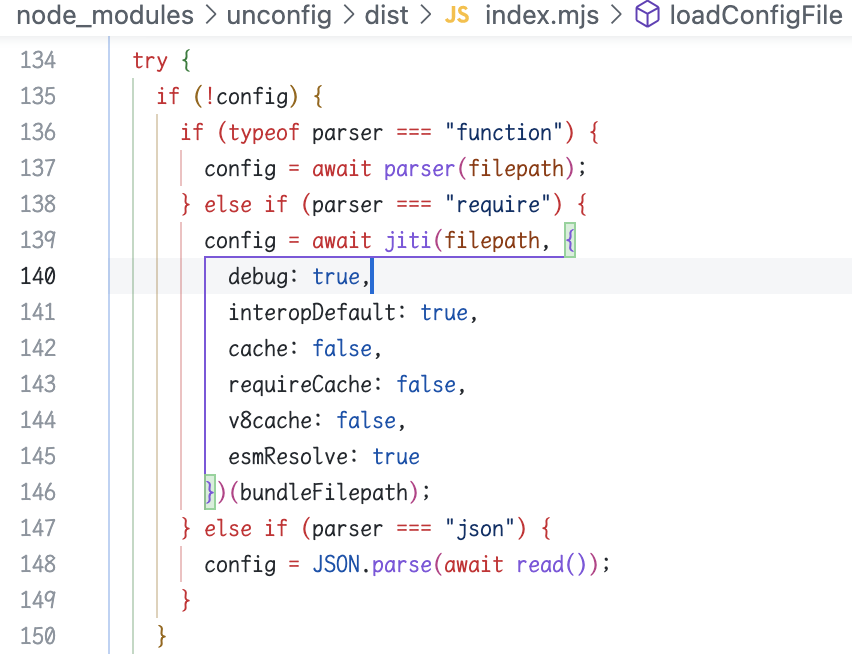
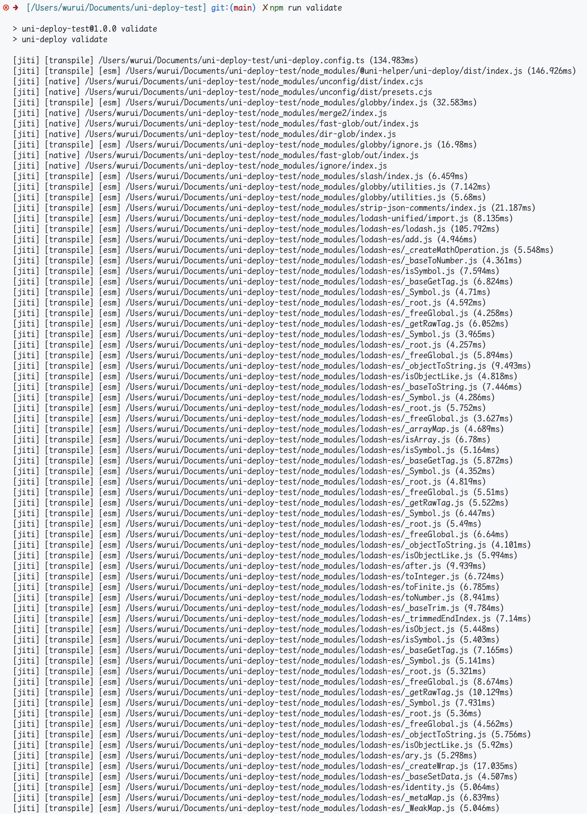

# uni-app-test

## issue

<https://github.com/uni-helper/uni-deploy/issues/2>

## Env

- node: 18.12.0
- npm: 9.1.2

## Steps

- `npm install`
- `npm run validate`

Expected: output `INFO [yyyy-mm-dd HH:MM:ss.l o]: 没有配置微信小程序，跳过微信小程序操作。`

Actual: stuck and output nothing in 1 mins

## Tries

- Update [node_modules/unconfig/dist/index.mjs#L140](./node_modules/unconfig/dist/index.mjs#L140)

- `npm run validate`, shows that `jiti` keeps transpiling `lodash-es`

